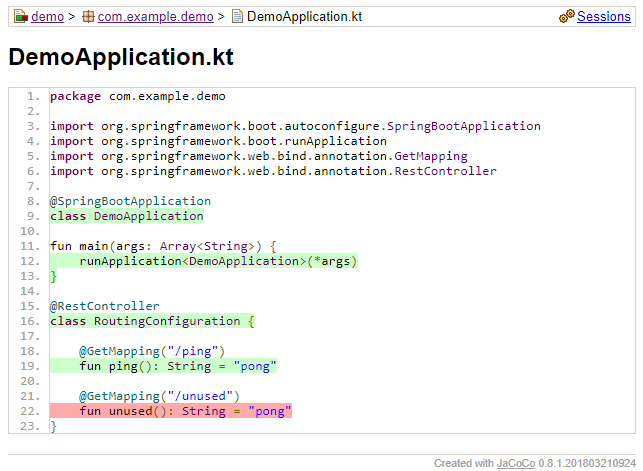

# Test coverage for containerized java apps

## tldr
When your deployment artifact is a docker image, you should systemtest against a container based on that image.
I will demonstrate how to get test coverage for a JVM app in that scenario.

## Introduction
Test coverage is a useful metric to help you analyze which parts of your app are touched by tests.
In JVM world this is usually done by using Jacoco which provides an agent that records calls to your code.

When the app runs inside a docker container instrumentation is little bit complicated, but doable.

I will use the project from a previous article ['Efficient docker images for Spring Boot applications'](https://bitbucket.org/martinmo/spring-docker-demo/src/coverage/), to show you what is necessary.

Sourcecode: [https://bitbucket.org/martinmo/spring-docker-demo/src/master/](https://bitbucket.org/martinmo/spring-docker-demo/src/master/)

## Setup
The project already contains a system test, that starts the docker image and makes a call to its HTTP api.

```kotlin
class DemoApplicationIT {

    @get:Rule
    var appContainer = KGenericContainer("spring-docker-demo:latest")
            .waitingFor(Wait.forListeningPort())
            .withExposedPorts(8080)

    val client: RestTemplate = RestTemplateBuilder().build()

    @Test
    fun `can call ping`() {
        val url = "http://localhost:${appContainer.getMappedPort(8080)}/ping"

        val response = client.getForEntity(url, String::class.java)

        assertThat(response.statusCode).isEqualTo(HttpStatus.OK)
        assertThat(response.body).isEqualTo("pong")
    }
}
```

I also added a second controller method that does not get called in the test, to show that the coverage report is ok.
```kotlin
@RestController
class RoutingConfiguration {

    @GetMapping("/ping")
    fun ping(): String = "pong"

    @GetMapping("/unused")
    fun unused(): String = "pong"
}
```


In order generate the coverage, 3 steps are necessary

1. Make the jacoco agent available inside the container
2. Start the app with the agent
3. Access the coverage report

## Make the jacoco agent available inside the container

We define a property for the jacoco version that we will use for the maven plugin and the dependency to the agent.
Using the dependency-plugin we copy the agent to _target/jacoco-agent_ removing the version from its name.
```xml
<properties>
    ...
    <jacoco.version>0.8.1</jacoco.version>
</properties>

<dependencies>
    ...
    <dependency>
        <groupId>org.jacoco</groupId>
        <artifactId>org.jacoco.agent</artifactId>
        <version>${jacoco.version}</version>
        <classifier>runtime</classifier>
        <scope>test</scope>
    </dependency>
</dependencies>

<build>
    ...
    <plugins>
        ...
        <plugin>
            <artifactId>maven-dependency-plugin</artifactId>
            <executions>
                ...
                <execution>
                    <id>copy-jacoco</id>
                    <goals>
                        <goal>copy-dependencies</goal>
                    </goals>
                    <phase>compile</phase>
                    <configuration>
                        <includeArtifactIds>org.jacoco.agent</includeArtifactIds>
                        <includeClassifiers>runtime</includeClassifiers>
                        <outputDirectory>${project.build.directory}/jacoco-agent</outputDirectory>
                        <stripVersion>true</stripVersion>
                    </configuration>
                </execution>
            </executions>
        </plugin>
       
    </plugins>
</build>

```

## Start the app with the agent
We use [Testcontainers](https://www.testcontainers.org/) to start our image.
If use anything else like docker-compose the idea is the same.

We mount two volumes into the container.
One that contains the agent at location _/jacoco-agent_.
And the other where the agent will put the generated coverage file (_/jacoco-report_).

To enable the agent we override the CMD with 

```
[
  "/usr/bin/java", 
  "-javaagent:/jacoco-agent/org.jacoco.agent-runtime.jar=destfile=/jacoco-report/jacoco-it.exec",
  "-jar",
  "/app.jar"
]
```
Using Testcontainer's API this looks like:
```kotlin
@get:Rule
var appContainer = KGenericContainer("spring-docker-demo:latest")
        .waitingFor(Wait.forListeningPort())
        .withExposedPorts(8080)
        .withFileSystemBind("./target/jacoco-agent", "/jacoco-agent")
        .withFileSystemBind("./target/jacoco-report", "/jacoco-report")
        .withCommand("/usr/bin/java",
                "-javaagent:/jacoco-agent/org.jacoco.agent-runtime.jar=destfile=/jacoco-report/jacoco-it.exec",
                "-jar",
                "/app.jar"
        )
```

If we call ```mvnw verify``` we will find a coverage file at _target/jacoco-report/jacoco-it.exec_.

## Access the coverage report

The bad news is, this file is way to small and does not contain the desired coverage data.
The problem is, that the jacoco agent only writes down the result when the JVM exits.
As Testcontainers kills the container without giving it time for a graceful shutdown, the agent cannot write its result to the file.

As a workaround we stop the container ourselves, which was previously done by the Junit rule.

```kotlin
@After
fun stopContainerGracefully() {
    appContainer.dockerClient
        .stopContainerCmd(appContainer.containerId)
        .withTimeout(10)
        .exec()
}
```

Now the jacoco plugin can generate a nice coverage report.

Configure it like
```xml
 <plugin>
    <groupId>org.jacoco</groupId>
    <artifactId>jacoco-maven-plugin</artifactId>
    <version>${jacoco.version}</version>
    <executions>
        <execution>
            <id>integration-coverage-report</id>
            <goals>
                <goal>report-integration</goal>
            </goals>
            <configuration>
                <dataFile>${project.build.directory}/jacoco-report/jacoco-it.exec</dataFile>
            </configuration>
        </execution>
    </executions>
</plugin>
```
in order to find a report in _target/site/jacoco-it/index.html_ that looks like that



# Conclusion
Getting coverage out of the container is not hard. If you use SonarQube and don't need the html report,
 you can skip the jacoco-maven-plugin completely. 
